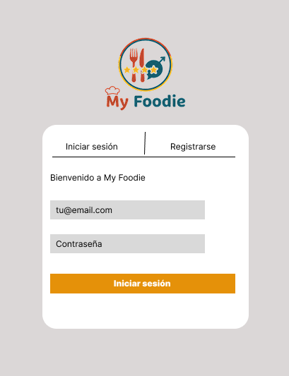
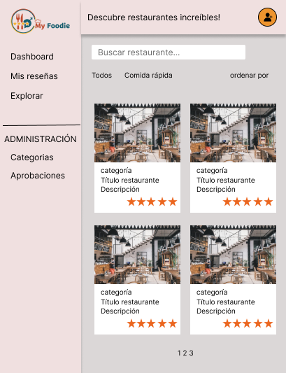

# 🍜 My Foodie - Calificación de Restaurantes

## 📘 Visión General del Proyecto

**My Foodie** es un proyecto Full Stack desarrollado como un taller
académico. Es una aplicación web completa que permite a los usuarios
registrar, calificar y rankear restaurantes y platos, simulando una
plataforma social de reseñas gastronómicas.

El objetivo fue construir una aplicación robusta desde cero, con un
backend en **Node.js (Express)** usando el driver nativo de **MongoDB**
y un frontend interactivo con **HTML, CSS (Bootstrap 5)** y **JavaScript
puro (Vanilla JS)**. El proyecto se enfoca en la modularidad,
autenticación por roles, operaciones transaccionales y consumo de una
API RESTful.

[▶️ Ver página en funcionamiento](https://sergiosteven66.github.io/My_Foodie_Frontend/index.html)

------------------------------------------------------------------------

## ✨ Características Principales

### 🔐 Sistema de Autenticación y Roles

-   Modal de Login y Registro.
-   Protección de rutas y lógica de interfaz basada en roles (cliente
    vs. admin).
-   Persistencia de sesión mediante **JSON Web Tokens (JWT)** en
    *localStorage*.

### 🍽️ Gestión de Restaurantes y Reseñas

-   **Exploración de Restaurantes:** Listado de restaurantes con
    filtrado por categoría y ordenamiento (Ranking, Popularidad,
    Recientes).
-   **Sistema de Reseñas (CRUD):** Los usuarios pueden crear, editar y
    eliminar sus propias reseñas.
-   **Votación (Like/Dislike):** Los usuarios pueden votar
    (like/dislike) en reseñas de otras personas, pero no en las
    propias.
-   **Proponer Restaurantes:** Los clientes pueden proponer nuevos
    restaurantes, que quedan "pendientes" de aprobación.

### 🧑‍💻 Dashboard y Panel de Administración

-   **Dashboard de Usuario:** Muestra estadísticas personales (Total de
    reseñas, Promedio, Restaurante favorito).
-   **Página "Mis Reseñas":** Historial de todas las reseñas publicadas
    por el usuario.
-   **Panel de Aprobaciones (Admin):** Permite a los administradores ver
    la lista de restaurantes pendientes y aprobarlos o rechazarlos.
-   **Gestión de Categorías (Admin):** CRUD completo para las categorías
    de restaurantes.
-   **Gestión de Platos (Admin):** Permite a los administradores añadir,
    editar y eliminar platos de un restaurante existente desde la página
    de detalle.

### 📱 Diseño Modular y Responsivo

-   **Arquitectura "SPA" con Vanilla JS:** El frontend simula una Single
    Page Application cargando dinámicamente el layout y los scripts de
    cada página.
-   **Diseño Responsivo:** Interfaz adaptada a dispositivos móviles y de
    escritorio usando **Bootstrap 5**.
-   **Componentes Reutilizables:** Lógica de renderizado separada en
    componentes (*ej. RestauranteCard, ReseñaCard*).

------------------------------------------------------------------------

## 🛠️ Tecnologías Utilizadas

### Backend

-   **Node.js y Express:** Para construir la API RESTful.
-   **MongoDB (Driver Oficial):** Como base de datos NoSQL.
-   **JWT (jsonwebtoken)** y **Passport:** Para autenticación y
    estrategias de protección.
-   **Bcrypt:** Para encriptación de contraseñas.
-   **Express-validator:** Para la validación de DTOs.
-   **Express-rate-limit:** Para seguridad y límite de peticiones.
-   **Swagger-UI-Express:** Para la documentación interactiva de la
    API.
-   **Dotenv, CORS, Semver.**

### Frontend

-   **HTML5:** Estructura semántica del contenido.\
-   **Bootstrap 5:** Framework CSS para layout, componentes y diseño
    responsivo.
-   **Bootstrap Icons:** Para la iconografía de la interfaz.
-   **JavaScript (ES Modules):** Lógica interactiva, modularización
    (separación en pages, services, components, utils) y manipulación
    del DOM sin frameworks.
---
# 🎨 Maquetación y Diseño (Figma)

El diseño de la interfaz de usuario (UI) de **My Foodie** fue creado en
**Figma**, enfocado en una experiencia de usuario limpia, moderna e
intuitiva para una plataforma de reseñas.

### 📊 Pantallas del Diseño

-   **Pantalla de Inicio**

-   **Pantalla de Dashboard**

-   **Panel de Detalle de restaurante**


🔗 **Link de Figma:** [Ver diseño completo en Figma](https://www.figma.com/proto/AYS9VAO7x1yqoeBFTh1nij/Sin-t%C3%ADtulo?node-id=0-1&t=K3x5RzyDJ06D5l35-1)

------------------------------------------------------------------------

## 🚀 Cómo Ejecutar el Proyecto

Este es un proyecto **Full Stack** y requiere que tanto el backend como
el frontend estén en ejecución.

### 1️⃣ Ejecutar el Backend

Clona el repositorio del backend:

``` bash
git clone https://github.com/BryanVillabona/My_Foodie_Backend.git
cd My_Foodie_Backend
```

Instala las dependencias:

``` bash
npm install
```

Configura tus variables de entorno creando un archivo `.env` (puedes
usar el `.env.example` como plantilla).\
Asegúrate de usar una URI de MongoDB que soporte transacciones (como un
Replica Set o Atlas).

``` bash
MONGO_URI=TU_MONGO_URI_CON_REPLICA_SET
DB_NAME=myfoodie_db
PORT=4000
JWT_SECRET=TU_CLAVE_SECRETA
FRONTEND_URL=http://127.0.0.1:5500
```

Puebla la base de datos con el catálogo y el usuario administrador:

``` bash
npm run seed
```

Inicia el servidor del backend:

``` bash
npm run dev
```

El servidor estará escuchando en:\
👉 **http://localhost:4000**

------------------------------------------------------------------------

### 2️⃣ Ejecutar el Frontend

Clona este repositorio (frontend):

``` bash
git clone https://github.com/sergiosteven66/My_Foodie_Frontend.git
cd My_Foodie_Frontend
```

Abre el archivo **index.html** en tu navegador web.

> 💡 Se recomienda usar una extensión como **Live Server** en Visual
> Studio Code para un desarrollo más fluido y evitar problemas de CORS.

⚠️ **Importante:**\
El frontend está configurado para conectarse a la API desplegada en
**Render**.\
Si ejecutas el backend localmente, debes cambiar la constante `API_URL`
en\
`assets/js/services/api.js` a:

    http://localhost:4000/api/v1

------------------------------------------------------------------------

## 📁 Estructura de Archivos

### 🗂️ Estructura del Backend (`My_Foodie_Backend`)

    src/
    ├── config/         # (db.js, passport.js)
    ├── controllers/    # (auth.controller.js, restaurantes.controller.js, ...)
    ├── docs/           # (swaggerDoc.js)
    ├── dtos/           # (auth.dto.js, restaurantes.dto.js, ...)
    ├── middlewares/    # (auth.middleware.js, validationDTO.js)
    ├── routers/        # (auth.routes.js, restaurantes.routes.js, ...)
    ├── services/       # (auth.services.js, restaurantes.services.js, ...)
    ├── utils/          # (ranking.js)
    ├── seed.js         # Script de población de BD
    └── server.js       # Archivo principal de Express

------------------------------------------------------------------------

### 🗂️ Estructura del Frontend (`My_Foodie_Frontend`)

    admin/
    │   ├── aprobaciones.html
    │   └── categorias.html
    assets/
    │   ├── css/
    │   │   └── style.css
    │   ├── img/
    │   │   └── (logo_myfoodie.png, ...)
    │   └── js/
    │       ├── components/   # (Layout.js, Modal.js, ReseñaCard.js, ...)
    │       ├── pages/        # (dashboard.js, detalle.js, adminAprobaciones.js, ...)
    │       ├── services/     # (api.js, auth.service.js, restaurantes.service.js, ...)
    │       ├── utils/        # (auth.js, guards.js, rendering.js, toast.js)
    │       └── main.js       # Enrutador principal
    │
    ├── dashboard.html
    ├── detalle.html
    ├── index.html
    ├── mis-resenas.html
    └── restaurantes.html

------------------------------------------------------------------------

## 🔗 Repositorio del Backend

El backend de esta aplicación, desarrollado con **Node.js** y
**Express**, se encuentra en el siguiente repositorio:\
[▶️ Ver Repositorio del Backend](https://github.com/BryanVillabona/My_Foodie_Backend.git)

------------------------------------------------------------------------

# 👥 Integrantes
| Nombre Completo | Rol |
|------------------|------|
| Bryan Villabona | Estudiante |
| Sergio Lievano   | Estudiante |

